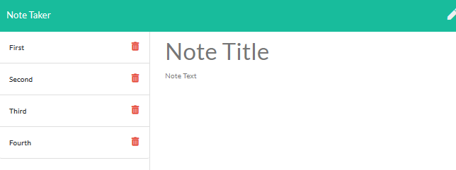

# Note-Taker

## Description 

This application allows a user to write down notes that are saved and can be viewed later or deleted.

## Table of Contents

* [Usage](#usage)
* [License](#license)
* [Questions](#questions)
* [Tests](#tests)

## Usage 

To use this app go to https://ejbrownlf-note-taker.herokuapp.com/

You write a note title where you see the label saying not title and below that you can write the contents of your note.
Click the save button at the top right to save the note for later.

* On the left hadn menu you can see saved notes.
* Click on the title of the note to display a previous note.
* Click the pencil icon at the top right corner to write a new note.
* Click the delete icon to delete a note.

Here is an example image the live site:

# License

This project is covered by the [MIT](https://opensource.org/licenses/MIT) License

# Questions

Here is a link to my [Github](https://github.com/ejbrownlf)

You can reach me by emailing me here at ejbrownlf@gmail.com

